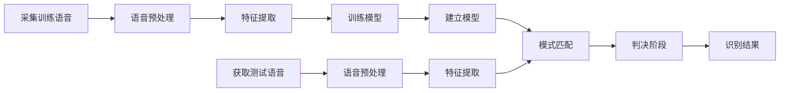
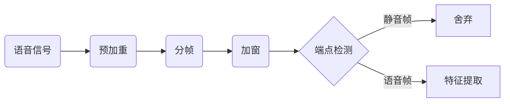

# README

本工作关注于重放攻击样本和真实样本之间的根本差别，结合了传统的ECAPA-TDNN声纹识别模型和基于LSTM的活体检测系统，还对原始样本进行了数据扩充，通过多个模态共同判断说话人是否能够通过认证。在不同场景对该声纹认证防伪系统进行实际测试，取得了总的系统准确率为92.28%的较好效果。

基于多模态融合的声纹认证防伪技术研究 

Anti-spoofing Techniques for Voiceprint Authentication based on Multi-modal Sensing Fusion

This thesis focuses on the fundamental differences between the

replayed audio samples and the genuine audio samples, conbines the traditional speaker

classification system based on ECAPA-TDNN with a liveness detection system based

on LSTM, and conducts data augmentation of original samples. The system determines

whether the speaker can be authenticated synthetically through multiple feature integra

tion. To verify the effectiveness of the system designed in this thesis, the anti-spoofing

voiceprint authentication system was tested in different evaluation scenarios by various

evaluation indicators, which achieved satisfactory results of overall accuracy 92.28%

and ensured great user experience and security performance.

## 基于x-vector的声纹认证系统

torchaudio提取MFCC搭网络实现 x-vector

数据集用librispeech clean 100

### 信号预处理

图2：语音信号预处理的流程

## 基于多模态融合的声纹认证防伪系统

分别构建一个声纹识别系统和一个活体识别系统，再联合两个系统

步骤分为数据准备跟训练模型。

### 数据准备

从http://www.openslr.org/12/网址下载librispeech数据
下载train-clean-100.tar.gz、train-clean-360.tar.gz、train-other-500.tar.gz 、test-clean.tar.gz、test-other.tar.gz 、dev-clean.tar.gz、dev-other.tar.gz
放置磁盘目录下(如/data/aiwork/librispeech/data)。

wget http://www.openslr.org/resources/12/train-clean-100.tar.gz

### 训练模型

# reference

- 开源语音数据集：http://www.openslr.org/resources.php
- Kaldi：http://kaldi-asr.org/doc/kaldi_for_dummies.html
- Kaldi实现xvector的例子：https://github.com/czyxm/x-vector-kaldi
- pytorch自带的语音库：https://pytorch.org/audio/stable/torchaudio.html
- 基于pytorch的一个新语音库speechbrain：https://github.com/speechbrain/speechbrain
- ECAPA-TDNN：https://github.com/TaoRuijie/ECAPA-TDNN/blob/main/model.py
- 浙江大学学位论文 LaTeX 模板：https://github.com/TheNetAdmin/zjuthesis
