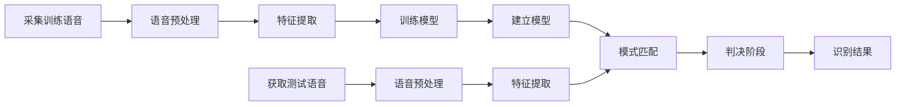
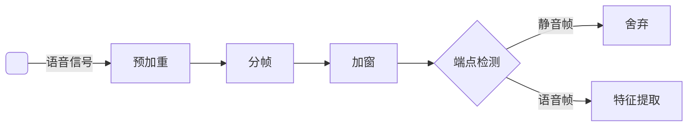

## 实现

torchaudio提取MFCC搭网络实现 x-vector

数据集用librispeech clean 100

开源语音数据集：http://www.openslr.org/resources.php
Kaldi：http://kaldi-asr.org/doc/kaldi_for_dummies.html
Kaldi实现xvector的例子：https://github.com/czyxm/x-vector-kaldi
pytorch自带的语音库：https://pytorch.org/audio/stable/torchaudio.html
基于pytorch的一个新语音库speechbrain：https://github.com/speechbrain/speechbrain

## Kaldi跑librispeech步骤

步骤分为数据准备跟训练模型。

kaldi环境默认是安装好的，这里不详细说明kaldi的安装步骤。
这里的实验是在Ubuntu16.04上跑的。

## **一、数据准备**

数据准备分为两种：手动下载跟脚本下载。

**1.手动下载**

1.1下载训练数据：

从http://www.openslr.org/12/网址下载librispeech数据
下载train-clean-100.tar.gz、train-clean-360.tar.gz、train-other-500.tar.gz 、test-clean.tar.gz、test-other.tar.gz 、dev-clean.tar.gz、dev-other.tar.gz
放置磁盘目录下(如/data/aiwork/librispeech/data)。

wget http://www.openslr.org/resources/12/train-clean-100.tar.gz

1.2.下载语言模型：

从http://www.openslr.org/11/ 网址下载language models, vocabulary and G2P models
下载3-gram.arpa.gz、3-gram.pruned.1e-7.arpa.gz 、
3-gram.pruned.3e-7.arpa.gz 、4-gram.arpa.gz、g2p-model-5、librispeech-vocab.txt 、librispeech-lexicon.txt、librispeech-lm-corpus.tgz

在kaldi/egs/librispeech/s5/data目录下，新建data/local/lm/目录
将下载的语言模型复制到
kaldi/egs/librispeech/s5/data/local/lm/目录下
lm目录下执行命令
ln -sf 3-gram.pruned.1e-7.arpa.gz lm_tgmed.arpa.gz
ln -sf 3-gram.pruned.3e-7.arpa.gz lm_tgsmall.arpa.gz
ln -sf 3-gram.arpa.gz lm_tglarge.arpa.gz
ln -sf 4-gram.arpa.gz lm_fglarge.arpa.gz
至此，数据准备完成。

**2.脚本执行下载数据**
训练模型run.sh脚本会包含下载数据跟语言模型(这里无需单独执行处理)。

## 二.训练模型

**2.1修改run.sh文件**

手动下载数据：
切换到kaldi/egs/librispeech/s5下打开run.sh文件。
将data=/export/a15/vpanayotov/data修改为librispeech存放数据的路径(如/data/aiwork/librispeech/data).
stage=1 修改为stage=2 ，表示执行本地的下载好的数据。
脚本执行下载数据：
无需修改。

**2.2修改cmd.sh文件**

单个一台服务器kaldi训练
切换到kaldi/egs/librispeech/s5/cmd.sh
将以下配置
export train_cmd=“queue.pl --mem 2G”
export decode_cmd=“queue.pl --mem 4G”
export mkgraph_cmd=“queue.pl --mem 8G”
修改为
export train_cmd=run.pl.
export decode_cmd=run.pl
export mkgraph_cmd=run.pl
2.3 执行run.sh训练模型
执行sudo apt-get install flac 安装flac。

注意：根据GPU实际情况修改，若只有一个GPU都设为1。
kaldi/egs/librispeech/s5/local/chain/run_tdnn.sh脚本配置。
将
–trainer.optimization.num-jobs-initial 3
–trainer.optimization.num-jobs-final 16
修改为
–trainer.optimization.num-jobs-initial 1
–trainer.optimization.num-jobs-final 1

切换到kaldi/egs/librispeech/s5/目录下
执行sh run.sh训练模型，等待训练结果。

