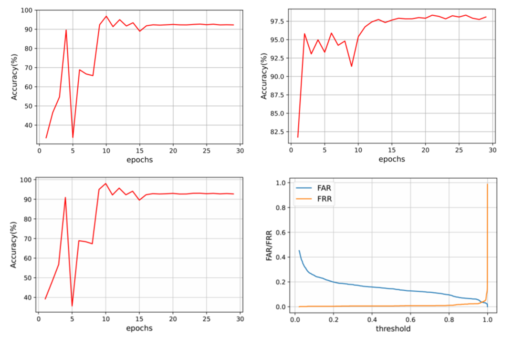

# 基于多模态融合的声纹认证防伪技术研究

# Anti-spoofing Techniques for Voiceprint Authentication based on Multi-modal Sensing Fusion

本工作关注于重放攻击样本和真实样本之间的根本差别，结合了传统的ECAPA-TDNN声纹识别模型和基于LSTM的活体检测系统，还对原始样本进行了数据扩充，通过多个模态共同判断说话人是否能够通过认证。在不同场景对该声纹认证防伪系统进行实际测试，取得了总的系统准确率为92.28%的较好效果。

This thesis focuses on the fundamental differences between the replayed audio samples and the genuine audio samples, conbines the traditional speaker classification system based on ECAPA-TDNN with a liveness detection system based on LSTM, and conducts data augmentation of original samples. The system determines whether the speaker can be authenticated synthetically through multiple feature integration. To verify the effectiveness of the system designed in this thesis, the anti-spoofing voiceprint authentication system was tested in different evaluation scenarios by various evaluation indicators, which achieved satisfactory results of overall accuracy 92.28% and ensured great user experience and security performance.

## 声纹认证系统建模与实现

用torchaudio提取MFCC搭网络实现x-vector

数据集用librispeech-clean-100

图1：声纹识别系统的流程

### 信号预处理

图2：语音信号预处理的流程

### 特征提取

图3-1：MFCC特征的提取过程

图3-2：Fbanks的提取过程

### 模型结构设计

图4-1：x-vector系统模型结构图

图5-2：ECAPA-TDNN系统模型结构图

## 基于多模态融合的声纹认证防伪系统

### 攻击场景

- 重放攻击
  - 额外噪声源
  - 多普勒频移特征
- 物理重放的同时活体扰动
  - 语音频段和超声频段的对齐性
  - 超声梯度特征可以放大相关性

### 模型结构设计

分别构建一个基于ECAPA-TDNN的声纹识别系统和一个基于LSTM的活体识别系统，再联合两个系统。

图6：声纹认证防伪系统模型总体架构设计

#### 输入特征

- 40维语音频段特征
- 61维超声频段特征
- 61维超声梯度特征

#### 损失函数

- 说话人分类任务
  $$
  \mathrm{loss1} = NLLLoss()
  $$

- 相关性检测任务
  $$
  \mathrm{loss2} = MSELoss()
  $$

- 总
  $$
  \mathrm{loss} = \frac{1}{\mathrm{epoch^2}}\cdot \mathrm{loss1}+(1-\frac{1}{\mathrm{epoch^2}})\cdot \mathrm{loss2}
  $$

## 测试与分析

### 数据集说明                                                                                                                                                                                          

文件命名：{spk_id}{scene_id}{seq}.wav

- 训练集（96774）
  - 正样本：201个人的48387条真实语音
  - 负样本：交换和偏移的方式构造，跟正样本一一对应

- 测试集（3600）
  - 正样本：20个人的1200条真实语音
  - 负样本：1200条重放攻击样本和1200条重放的同时随机嘴部运动的样本

### 实验设置

#### 输入设置

- 在0~8000Hz提取40维Fbanks特征

- 在19700~20300Hz提取61维多普勒频移特征

- 频谱特征单位转换为db

- 标准化使在0~1之间

- 随机裁剪3s（120帧） 

- 计算梯度特征

- 三种特征拼接

#### 训练和测试设置

- 训练和测试batchsize取64

- 初始学习率0.001

- Adam优化器

- MultiStepLR scheduler

- TDNN和SE-Block通道数取512

- 注意池化层bottleneck特征通道数128

- Res2Block的scale取8

### 测试策略与结果

总的说话人识别系统的accuracy、EER

- 说话人分类任务的accuracy

- 活体检测任务的accuracy、EER

图7：声纹认证防伪系统的总准确率（左上）、说话人分类任务的准确率（右上）、活体检测任务的准确率（左下）以及等错率（右下）曲线图

FAR和FRR

- FAR评估不同负样本的通过率，用于验证安全性
  - 人为构造
    - 交换

    - 偏移

  - 真实采集
    - 重放攻击的样本
    - 重放的同时随机嘴部运动的样本

- FRR评估不同正样本的通过率，用于验证用户体验

不同任务对系统性能的影响

- 文本相关（小艺小艺）

- 文本无关

  - 包含了大量不同的文本，评估已知文本和未知文本的影响，即训练集中是否包括某些文本时的性能

不同采集场景的数据对系统性能的影响（噪声分贝不同）

- 居家

- 办公室

- 车载

不同采集条件的数据对系统性能的影响

- 距离录音设备的距离

  - 0.3

  - 0.5

  - 1
- 距离录音设备的角度

  - 0
  - 30
  - 60
  - 90
- 车载车窗状态开启和关闭

  - 开启

  - 关闭

## 优化

- 改进损失函数
- 数据增强
  - 多风格训练
  - 时频谱增强
- 抵御语音合成等其他攻击形式

## layout

## reference

- 开源语音数据集：http://www.openslr.org/resources.php
- Kaldi：http://kaldi-asr.org/doc/kaldi_for_dummies.html
- Kaldi实现xvector：https://github.com/czyxm/x-vector-kaldi
- Pytorch实现xvector：https://github.com/jaeminh/xvector
- pytorch自带的语音库：https://pytorch.org/audio/stable/torchaudio.html
- 基于pytorch的一个新语音库speechbrain：https://github.com/speechbrain/speechbrain
- ECAPA-TDNN开源实现：https://github.com/TaoRuijie/ECAPA-TDNN/blob/main/model.py
- 浙江大学学位论文LaTeX模板：https://github.com/TheNetAdmin/zjuthesis
